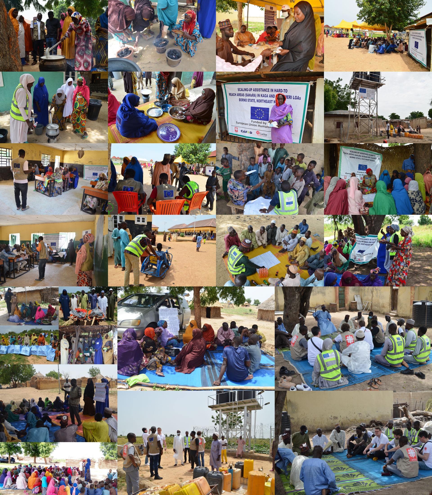

# SAHaRA II Project Impact Analysis 



Welcome to the public repository for the **SAHaRA II** project impact analysis. This repository contains the data and code used to evaluate the project's outcomes and share insights from its impact analysis.

Reproducibility is a cornerstone of scientific integrity, ensuring that research findings can be consistently verified and validated by other researchers. In the context of poverty alleviation and humanitarian aid, reproducibility is particularly critical. It allows policymakers and practitioners to rely on robust evidence when designing and implementing interventions, thereby maximising the impact and efficiency of aid programs. Reproducible research fosters transparency, enabling stakeholders to scrutinise and trust the methodologies and results presented. This is vital in humanitarian contexts where resources are limited, and the need for effective, evidence-based solutions is urgent. 

Ensuring that studies on poverty and humanitarian aid are reproducible not only enhances credibility but also facilitates knowledge sharing and innovation, driving continuous improvement in efforts to alleviate human suffering and promote sustainable development.

## 📋 Project Overview

The **"Scaling-Up Assistance in Hard-to-Reach Areas, Phase II" (SAHaRA II)** project, led by Caritas Germany in partnership with the Catholic Caritas Foundation of Nigeria (Caritas Nigeria), Justice Development and Peace Commission (JDPC) Maiduguri, and the Catholic Agency for Overseas Development (CAFOD), aimed to provide essential food and WASH support to vulnerable internally displaced persons (IDPs), returnees, and host community members in remote locations in Borno State, Nigeria.

## 📂 Repository Contents

This repository contains the following:

1. **Data** 📊
   - Quantitative and qualitative data from four needs assessments conducted in January 2021, December 2021/January 2022, December 2022/January 2023, and December 2023.
   - Anonymised datasets used in the analysis.

2. **Code** 💻
   - RMarkdown files used for data cleaning, analysis, and visualisation.
   - Scripts for Difference-in-Differences (DiD) and Propensity Score Matching (PSM) analyses.
   - Machine learning models (Random Forest) for identifying key predictors influencing outcomes.

3. **Documentation** 📑
   - Detailed explanations of the methods used for data collection and analysis.
   - Descriptions of the variables in the datasets, including form questions and answer options.
   - Instructions for replicating the analysis.
   - The text of the RMD (RMarkdown file) is not the final one. The report in its final version is in the file "Impact Analysis Report - ECHO SAHaRA Project (Nigeria).pdf"
   - The folder also includes the learning brief in PDF format summarising the key messages for dissemination.

## 🚀 Getting Started

### Prerequisites

To run the code and reproduce the analysis, you will need:

- R (version 4.0 or later)
- RStudio
- R packages: `tidyverse`, `randomForest`, `MatchIt`, `survey`, `dplyr`, `ggplot2`, `rmarkdown`, `knitr`, and others as specified in the RMarkdown files.

### Installation

Clone this repository to your local machine using the following command:

```bash
git clone https://github.com/movimentar/sahara-II-impact-analysis.git
```

### Running the Analysis

1. Open the R project file in RStudio.
2. Install the required R packages if not already installed.
3. Run the RMarkdown files to replicate the data cleaning, analysis, and visualisation steps.

## 📊 Methodology

### Quantitative Analysis

- **Household Surveys**: Conducted at four time points, covering 5,421 households.
- **Difference-in-Differences (DiD)**: Used to measure the project's impact by comparing treatment and control groups over time.
- **Propensity Score Matching (PSM)**: Employed to ensure comparability between treatment and control groups and to account for selection bias.

### Machine Learning

- **Random Forest Models**: Used to identify key predictors of outcomes such as food security and coping strategies. These predictors were integrated into the DiD and PSM analyses to enhance their precision.

### Qualitative Insights

- **Key-Informant Interviews & Focus Groups**: Provided contextual understanding and captured the lived experiences of beneficiaries and stakeholders.
- **Observational Surveys**: Gathered additional contextual data from the project areas.

### Transparency & Reproducibility

- Data collection utilised the KoboToolbox system.
- Analysis was conducted using RMarkdown, ensuring transparency and reproducibility.
- Anonymised data and code are available in this repository.

## 📜 License

This project is licensed under the Apache License Version 2.0, January 2004. See the LICENSE file for more details.

## 🙏 Acknowledgements

We acknowledge the efforts of the SAHaRA II project team, all partners, and the beneficiaries who participated in the assessments and provided valuable feedback. This work was made possible by funding from the European Union Civil Protection and Humanitarian Aid Operations (ECHO).

## 📞 Contact

For questions or further information, please contact the project team at [movimentar GmbH](https://www.movimentar.eu).

Thank you for your interest in the SAHaRA II project impact analysis. We hope this repository provides valuable insights and facilitates further research and learning.